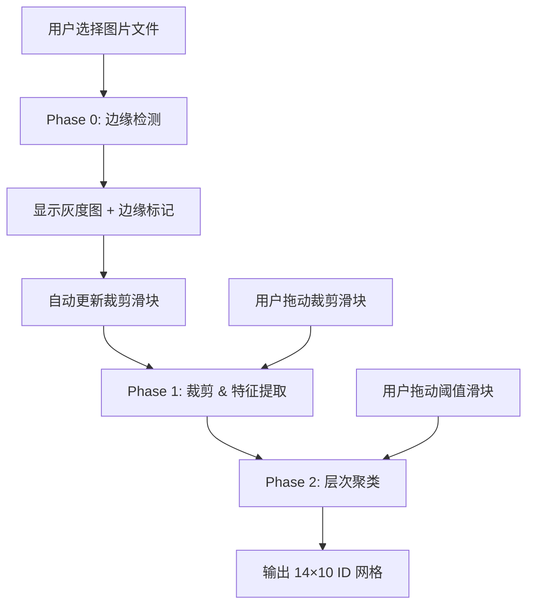

# 🖼️ 图片网格解析工具 — 设计文档

> **文件**: `parse.html` + `parse.js`  
> **运行**: 浏览器直接打开 `parse.html`  
> **用途**: 从 14×10 游戏截图中还原布局网格（ID 矩阵）  
> **核心算法**: 边缘检测 → 格子裁剪 → FFT 特征提取 → 层次聚类

---

## 1. 概述

解析工具（Parser）是游戏 `ylx.html` 的辅助工具，用于将一张游戏截图自动还原为 14×10 的 ID 网格。用户上传截图后，工具依次执行：

1. **边缘检测** — 自动识别网格边界，计算裁剪比例
2. **格子裁剪** — 按裁剪比例裁出网格区域，分割为 140 个独立格子
3. **FFT 特征提取** — 对每个格子做 32×32 的 2D FFT，提取频谱特征
4. **层次聚类** — 基于 L1 特征距离进行自底向上聚类，分配 ID

用户可手动微调裁剪比例和相似度阈值，工具会实时重新解析。

---

## 2. 系统架构

```
┌──────────────────────────────────────────────────┐
│                   parse.html                      │
│  ┌────────────┐ ┌────────────┐ ┌──────────────┐ │
│  │ 文件上传    │ │ 参数面板    │ │ 预览/输出区   │ │
│  │ (file)     │ │ (滑块×5)   │ │ (canvas×N)   │ │
│  └────────────┘ └────────────┘ └──────────────┘ │
├──────────────────────────────────────────────────┤
│                   parse.js                        │
│  ┌────────────────────────────────────────────┐  │
│  │  数据类: CellData, Cluster, FFTResult      │  │
│  ├────────────────────────────────────────────┤  │
│  │  边缘检测: performEdgeDetection()          │  │
│  │    └→ toGrayscale, detectEdges,           │  │
│  │       markEdgesOnGray                       │  │
│  ├────────────────────────────────────────────┤  │
│  │  裁剪 & 特征: cropGridRegion()             │  │
│  │    └→ cropImage, resizeImage, toGrayscale, │  │
│  │       applyTukeyWindow, calculateFFTFeatures│  │
│  ├────────────────────────────────────────────┤  │
│  │  FFT: fft2d → fft1d (Cooley-Tukey)        │  │
│  │    └→ fftMagnitude, fftShift              │  │
│  ├────────────────────────────────────────────┤  │
│  │  聚类: matchHashes()                       │  │
│  │    └→ featureDistance (L1/SAD)             │  │
│  │    └→ 层次聚类（偶数和约束）                 │  │
│  ├────────────────────────────────────────────┤  │
│  │  渲染: renderCellGrid, renderStats,        │  │
│  │        renderResizedPreview                 │  │
│  └────────────────────────────────────────────┘  │
└──────────────────────────────────────────────────┘
```

---

## 3. 全局常量与参数

### 3.1 算法常量

| 常量 | 值 | 说明 |
|------|-----|------|
| `FFT_SIZE` | 32 | FFT 变换尺寸（32×32） |
| `FFT_CENTER` | 16 | FFT shift 后中心坐标 |
| `MANHATTAN_RADIUS` | 10 | 特征提取环形区域外半径 |
| `FEATURE_COUNT` | 168 | 特征向量维度（环形区域点数，动态计算） |
| `EDGE_DETECTION_WIDTH` | 256 | 边缘检测时缩放宽 |

### 3.2 可调参数（UI 滑块）

| 参数 | 默认值 | 范围 | 说明 |
|------|--------|------|------|
| `SIMILARITY_THRESHOLD` | 0.1 | 0 ~ 1 | L1 距离阈值，越小越严格 |
| `CROP_TOP_RATIO` | 0.12 | 0 ~ 0.30 | 顶部裁剪比例 |
| `CROP_BOTTOM_RATIO` | 0.15 | 0 ~ 0.30 | 底部裁剪比例 |
| `CROP_LEFT_RATIO` | 0.02 | 0 ~ 0.05 | 左侧裁剪比例 |
| `CROP_RIGHT_RATIO` | 0.02 | 0 ~ 0.05 | 右侧裁剪比例 |

### 3.3 Tukey 窗参数

| 参数 | 值 | 说明 |
|------|-----|------|
| `r`（余弦比例） | 0.4 | 边缘 40% 使用余弦渐变，中间 20% 平坦 |

---

## 4. 数据类设计

### 4.1 `CellData` — 格子数据

```js
class CellData {
  r, c           // 行、列索引 (0-13, 0-9)
  canvas         // 裁剪后的格子 canvas（中心 90%）
  grayscaleBase64       // 原始灰度图 base64（加窗前）
  windowedGrayscaleBase64 // 加窗后灰度图 base64
  fftReal        // FFT 实部 Float32Array(1024)
  fftImag        // FFT 虚部 Float32Array(1024)
  features       // 特征向量 Float32Array
  shiftedMagnitude // 移位幅度谱 Float32Array(1024)
  id             // 聚类后 ID (number|null)
}
```

### 4.2 `Cluster` — 聚类

```js
class Cluster {
  id             // 聚类 ID
  features       // 加权平均特征向量 Float32Array(100)
  shiftedMagnitude // 加权平均幅度谱 Float32Array(1024)
  cells          // CellData[] 类内格子列表
}
```

### 4.3 `FFTResult` — FFT 结果

```js
class FFTResult {
  real, imag     // FFT 实部/虚部
  features       // 特征向量
  shiftedMagnitude // 移位幅度谱
}
```

---

## 5. 完整运行流程

### 5.1 流程总览



### 5.2 Phase 0: 边缘检测 (`performEdgeDetection`)

**输入**: 图片 File 对象  
**输出**: `{ originalCanvas, grayCanvas, edgeCanvas, edges, cropRatios }`

**步骤**:

```
1. 加载图片 → originalCanvas（原始尺寸）
2. 等比缩放宽度到 256px (EDGE_DETECTION_WIDTH)
   - targetHeight = floor(img.height * 256 / img.width)
3. 转灰度：toGrayscale(imageData)
   - 亮度公式: 0.299×R + 0.587×G + 0.114×B
4. 检测横向边缘 (detectEdges):
   - 遍历每对相邻行 (y, y+1)
   - 计算该行所有像素的垂直梯度 |gray[y+1][x] - gray[y][x]|
   - 统计梯度 > 30 的像素数，若超过 width×70% → 标记为边缘行
   - topEdge = 第一个边缘行，bottomEdge = 最后一个边缘行
5. 检测纵向边缘:
   - 同理，遍历每对相邻列，统计水平梯度
   - 阈值 > 50% 列像素
   - leftEdge = 第一个边缘列，rightEdge = 最后一个边缘列
6. 标记边缘（红色）→ edgeCanvas
7. 计算裁剪比例（坐标-0.5 修正）:
   - topRatio = (topEdge - 0.5) / targetHeight
   - bottomRatio = 1 - (bottomEdge + 1 - 0.5) / targetHeight
   - leftRatio = (leftEdge - 0.5) / targetWidth
   - rightRatio = 1 - (rightEdge + 1 - 0.5) / targetWidth
8. Clamp + 应用最大值限制
```

**坐标修正说明**: 梯度计算使用相邻像素对，如 `|gray[y+1][x] - gray[y][x]|`，边缘实际位于 `y + 0.5` 处，因此公式中减去 0.5 做亚像素修正。

### 5.3 Phase 1: 裁剪 & 特征提取 (`cropGridRegion`)

**输入**: 图片 File + 四个裁剪比例  
**输出**: `{ originalCanvas, croppedCanvas, cellW, cellH, cellData[], cropParams }`

**步骤**:

```
1. 加载图片 → originalCanvas（原始尺寸）
2. 按比例定位裁剪区域:
   - cropX = round(img.width × leftRatio)
   - cropY = round(img.height × topRatio)
   - cropW = round(img.width × (1 - leftRatio - rightRatio))
   - cropH = round(img.height × (1 - topRatio - bottomRatio))
3. 裁出网格区域 → croppedCanvas
4. 计算格子尺寸:
   - cellW = round(cropW / 10)
   - cellH = round(cropH / 14)
5. 遍历 14×10 = 140 格子，对每个格子:
   a. 从 croppedCanvas 裁出 (x=c×cellW, y=r×cellH, w=cellW, h=cellH)
   b. 边框裁剪: 裁掉四边各 5%，保留中心 90%（减少边框干扰）
   c. 生成灰度 base64 (grayscaleBase64, 用于预览)
   d. 缩放至 32×32 (resizeImage, 双线性插值)
   e. 转灰度 (toGrayscale)
   f. 应用 Tukey 窗 (applyTukeyWindow, r=0.4, 反向模式)
   g. 生成加窗灰度 base64 (windowedGrayscaleBase64)
   h. 计算 FFT 特征 (calculateFFTFeatures) → FFTResult
   i. 创建 CellData(r, c, canvas, grayscaleBase64, windowedGrayscaleBase64, ...)
```

**边框裁剪**: 为什么再裁 5%？
- 从网格区域切出来的每个格子，其边缘可能包含相邻格子的边框线
- 裁剪掉四周 5% 确保特征提取聚焦于图标内容本身

#### 5.3.1 Tukey 窗（反向模式）

```
公式:
  windowed[i] = 255 - (255 - gray[i]) × window[i]

效果:
  - 中间区域 (window≈1): 保持原灰度值
  - 边缘区域 (window≈0): 趋近白色 (255)

目的: 减少 FFT 的频谱泄漏（边缘不连续导致的伪影）
反向模式: 使边缘变亮而非变暗，适配浅色背景的图标
```

Tukey 窗一维公式:
```
当 0 ≤ n < r/2:            w[n] = 0.5×(1 + cos(2π/r × (n - r/2)))
当 r/2 ≤ n ≤ 1-r/2:       w[n] = 1
当 1-r/2 < n ≤ 1:          w[n] = 0.5×(1 + cos(2π/r × (n - 1 + r/2)))
```

2D 窗通过 `w[x] × w[y]` 外积生成。使用缓存 `TUKEY_WINDOW_CACHE` 避免重复计算。

#### 5.3.2 双线性插值缩放 (`resizeImage`)

将任意尺寸的格子缩放到 32×32：

```
对每个目标像素 (x, y):
  oldX = x × (oldW / newW)
  oldY = y × (oldH / newH)
  取四个源像素加权平均
```

#### 5.3.3 FFT 特征提取 (`calculateFFTFeatures`)

**输入**: 已加窗的 32×32 灰度数组  
**输出**: `FFTResult`

```
1. 2D FFT (fft2d):
   - 逐行 1D FFT → 逐列 1D FFT
2. 幅度谱计算:
   - magnitude[i] = sqrt(real[i]² + imag[i]²)
3. 幂函数缩放:
   - magnitude[i] = magnitude[i]^0.4
   （压缩幅度谱动态范围，抑制低频主导）
4. FFT Shift:
   - 将 DC 分量移到中心
5. 特征提取（曼哈顿环形区域）:
   - 遍历 32×32 频谱图
   - 取满足 2 < |dx|+|dy| < MANHATTAN_RADIUS 的点
   - 按行优先顺序展平为特征向量
```

**为什么用曼哈顿环形区域？**
- 排除中心低频 (d ≤ 2): 对应整体亮度和渐变信息，对图标区分贡献小
- 排除外圈高频 (d ≥ MANHATTAN_RADIUS): 对应噪声和细节，不稳定
- 保留中频环: 对应图标的结构纹理，区分度最好

**特征向量维数**: 曼哈顿距离 ≤ r 的点数公式为 $2r^2 + 2r + 1$，代码中 `FEATURE_COUNT` 动态计算：

$$(2 \cdot 9^2 + 2 \cdot 9 + 1) - (2 \cdot 2^2 + 2 \cdot 2 + 1) = 181 - 13 = 168$$

---

### 5.3.4 1D FFT 实现 (`fft1d`)

采用**非递归 Cooley-Tukey 算法**：

```
1. 位反转置换 (Bit-reversal permutation):
   for i in 0..n-1:
     j = bit_reverse(i, bits)
     if i < j: swap(real[i], real[j]), swap(imag[i], imag[j])

2. 迭代蝶形运算:
   for len = 2, 4, 8, ..., n:
     halfLen = len / 2
     for i = 0, len, 2*len, ..., n-len:
       for k in 0..halfLen-1:
         W = exp(-j×2π×k/len)  ← 预计算在 FFT_CACHE 中
         t = W × (real[i+k+halfLen] + j×imag[i+k+halfLen])
         (real[i+k+halfLen], imag[i+k+halfLen]) = src - t
         (real[i+k], imag[i+k]) = src + t
```

预计算表 `FFT_CACHE` 缓存了 cos 和 sin 值，键为 `k × n/len`，均为整数索引，无精度损失。

---

### 5.4 Phase 2: 层次聚类 (`matchHashes`)

**输入**: `cellData[]` + `threshold`  
**输出**: `{ grid[][], gridHashes[], stats }`

**算法**: 自底向上凝聚层次聚类（Agglomerative Hierarchical Clustering）

```
步骤 1: 初始化 — 每个格子一个 Cluster
  tempClasses = [Cluster(0, cell0.features, ...), Cluster(1, cell1.features, ...), ...]
  (共 140 个初始类)

步骤 2: 迭代合并
  while true:
    a. 找到距离最近的两个类 (mergeI, mergeJ)
       - 遍历所有类对 (i, j), i < j
       - 跳过满足 (size_i + size_j) 为奇数的对（游戏约束：成对出现）
       - 计算 L1 归一化距离
       - 记录最小距离

    b. 若 minDist > threshold 或 无可合并 → break

    c. 合并:
       - 加权平均特征向量:
         newFeatures[k] = (f_i[k]×size_i + f_j[k]×size_j) / (size_i + size_j)
       - 加权平均幅度谱（同上）
       - 创建新 Cluster，合并格子列表
       - 从 tempClasses 移除 mergeJ，替换 mergeI

步骤 3: 赋予 ID
  for cls in tempClasses:
    cls.id = ++idCounter (从 1 开始)
    更新 cls 下所有 CellData 的 id

步骤 4: 构建输出网格
  - 按 (r,c) 定位每个已聚类的格子
  - 构建 [c][r] 中间矩阵，转置为 [r][c] 最终网格
```

#### 5.4.1 偶数约束

```js
if ((tempClasses[i].getSize() + tempClasses[j].getSize()) % 2 !== 0) {
  continue;  // 跳过
}
```

这个约束基于游戏机制：每个图标 ID 在网格中通常**成对出现**（初始化算法每个 ID push 两次）。合并后格子总数若为奇数，则该聚类不可能对应真实图标。

#### 5.4.2 L1 距离（归一化 SAD）

```js
featureDistance(f1, f2) = Σ|f1[i] - f2[i]| / N
```

- N = 特征向量长度
- 归一化使阈值在不同图片上更具通用性

---

## 6. UI 交互流程

### 6.1 文件选择

```
用户点击 "📁 选择图片"
  → fileInput.onchange
    → 显示参数面板
    → 隐藏之前的预览/输出
    → performEdgeDetection(file)
       → 展示灰度图 + 边缘标记
       → 自动更新裁剪滑块为检测结果
    → performCropAndMatch()
       → 展示裁剪预览
       → 展示 140 格灰度网格
       → 展示统计表格（ID-图标映射）
       → 输出 14×10 文本网格
```

### 6.2 阈值调整

```
用户拖动阈值滑块 (thresholdSlider.onchange)
  → 更新 SIMILARITY_THRESHOLD
  → matchHashes(cellData, newThreshold)  ← 只重新聚类，不重新裁剪
  → 更新格子预览、统计表格、文本输出
```

### 6.3 裁剪比例调整

```
用户拖动任意裁剪滑块 (cropSlider.onchange)
  → 更新对应 CROP_*_RATIO
  → performCropAndMatch()  ← 完整重跑 Phase 1 + Phase 2
  → 更新所有预览
```

### 6.4 输出

```
文本区域: 14行 × 每行10个数字（空格分隔）
  - 可直接复制到剪贴板
  - 可粘贴到 ylx.html 的 "导入网格" 弹窗
```

---

## 7. 预览渲染系统

### 7.1 边缘检测预览

| 视图 | ID | 内容 |
|------|-----|------|
| 灰度图 | `grayPreview` | 256px 宽的灰度原图 |
| 边缘标记 | `edgePreview` | 灰度图上叠加红色边缘线 |
| 裁剪区域 | `resizedPreview` | 裁剪后网格区域（200px 宽） |

### 7.2 格子网格预览 (`renderCellGrid`)

- 以 flex-wrap 布局展示 140 个格子灰度缩略图
- 每个格子 50×50px
- cellData 按裁剪顺序（先行后列）遍历
- 鼠标悬停显示 ID

### 7.3 统计表格 (`renderStats`)

| 列 | 内容 |
|-----|------|
| ID | 聚类编号 |
| FFT 幅度谱 | 32×32 频谱图（像素化渲染） |
| 特征向量 | 168 维向量数值（可滚动） |
| 格子列表 | 该类所有格子的加窗灰度缩略图 |

---

## 8. 关键算法深度解析

### 8.1 边缘检测算法

```
类型: 基于梯度的简单边缘检测（非 Canny/Sobel）
梯度阈值: 30（像素值差异）
横向边缘判定: 该行超过 70% 像素的垂直梯度 > 30
纵向边缘判定: 该列超过 50% 像素的水平梯度 > 30
```

设计考量：
- 游戏截图通常有清晰的网格边框，简单的梯度检测即足够
- 缩放至 256px 宽降低噪声并加速运算
- 70%/50% 阈值过滤掉图片内容内部的纹理变化

### 8.2 特征提取链

```
原始格子 (cellW×cellH)
  ↓ 边框裁剪 (去掉 5%)
中心区域
  ↓ 缩放 (双线性, →32×32)
32×32 RGBA
  ↓ toGrayscale (亮度)
32×32 灰度
  ↓ Tukey 窗 (r=0.4, 反向)
32×32 加窗灰度
  ↓ 2D FFT
32×32 复数频谱
  ↓ 幅度谱 + x^0.4 压缩
32×32 幅度
  ↓ FFT Shift (DC→中心)
32×32 移位幅度
  ↓ 环形采样 (2 < 曼哈顿 < MANHATTAN_RADIUS)
168 维特征向量
```

### 8.3 幂函数压缩

`magnitude[i] = magnitude[i]^0.4`

- 原始 FFT 幅度谱低频分量可能比高频大几个数量级
- 幂函数压缩使不同频段的能量差异缩小
- 指数 0.4 是经验值，平衡了中高频信息的保留与低频主导的抑制

### 8.4 层次聚类复杂度

- 初始 140 个类
- 每次迭代需 O(n²) 距离计算
- 平均合并到 ~16-48 个类
- 总体约 O(n³) 最坏，实际因偶数约束和阈值截断快得多

---

## 9. 与游戏的关系

```
parse.html/parse.js          ylx.html/ylx.js
┌─────────────────┐         ┌─────────────────┐
│  游戏截图         │ ───→   │  14×10 ID 网格   │
│  (PNG/JPG)      │  解析   │  (导入网格)       │
│                 │         │                 │
│  输出:          │         │  游戏操作:       │
│  1 2 3 ...     │         │  clear / move   │
│  4 5 6 ...     │         │  hint / auto    │
│  ...           │         │                 │
└─────────────────┘         └─────────────────┘
```

**工作流**:
1. 在游戏中截图当前局面
2. 用 Parser 解析截图 → 得到 ID 网格文本
3. 在另一个游戏实例中 "导入网格" → 精确还原局面
4. 可以利用游戏的 hint/auto 功能求解

**ID 映射**: Parser 分配的 ID 从 1 开始自增，与原始游戏中的图标 ID（1~48）无关。导入后游戏将直接使用 Parser 输出的 ID。

---

## 10. 扩展点与改进方向

### 10.1 当前限制

- 边缘检测对无边框或复杂背景截图可能失败
- 格子必须恰好 14×10，无法处理不同规格的网格
- 特征提取只用 FFT 幅度谱，丢失了相位信息
- 聚类为硬分配，无"不确定"处理

### 10.2 可能改进

| 方向 | 方案 |
|------|------|
| 边缘检测鲁棒性 | 改用 Hough 直线检测或轮廓分析 |
| 通用网格 | 支持参数化 ROWS×COLS |
| 相位信息 | 结合幅度+相位做更精细的特征 |
| 软聚类 | 引入置信度，对模糊格子标记警告 |
| 深度学习 | 用 CNN 替代 FFT 特征提取，直接端到端识别图标 |

---

## 11. 文件清单

| 文件 | 行数 | 职责 |
|------|------|------|
| `parse.html` | ~800 | UI 结构、样式、事件绑定 |
| `parse.js` | ~1200 | 核心算法（数据类、边缘检测、裁剪、FFT、聚类、渲染） |
| `parse.html` 内嵌 `<script>` | ~250 | UI 交互逻辑（滑块事件、流程编排） |

---
